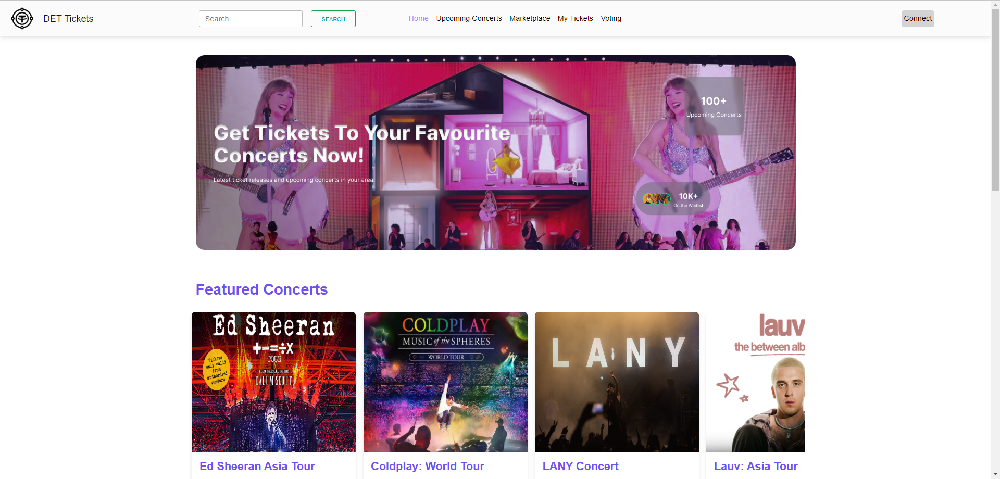
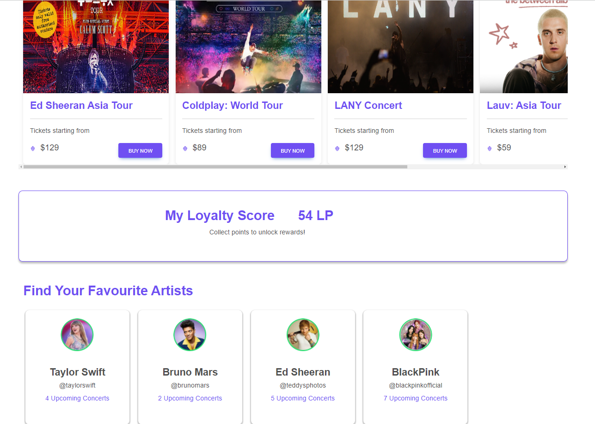
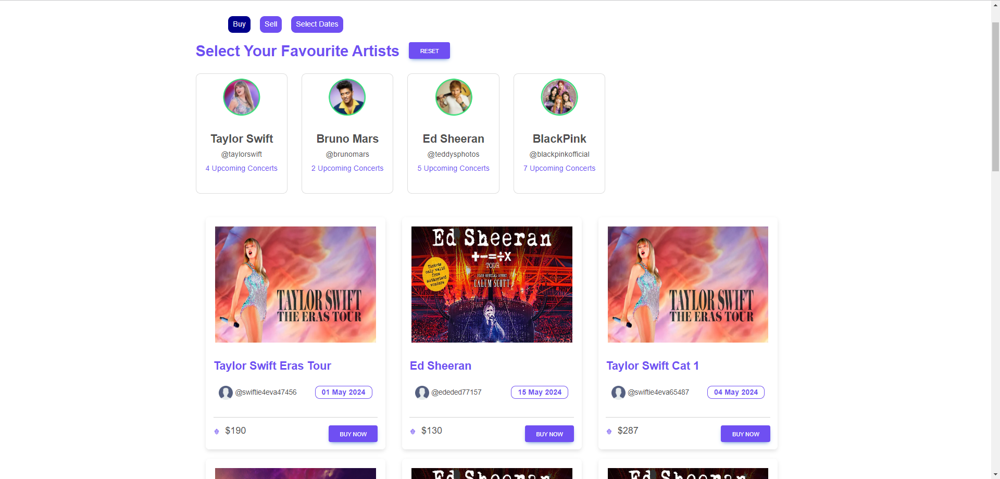
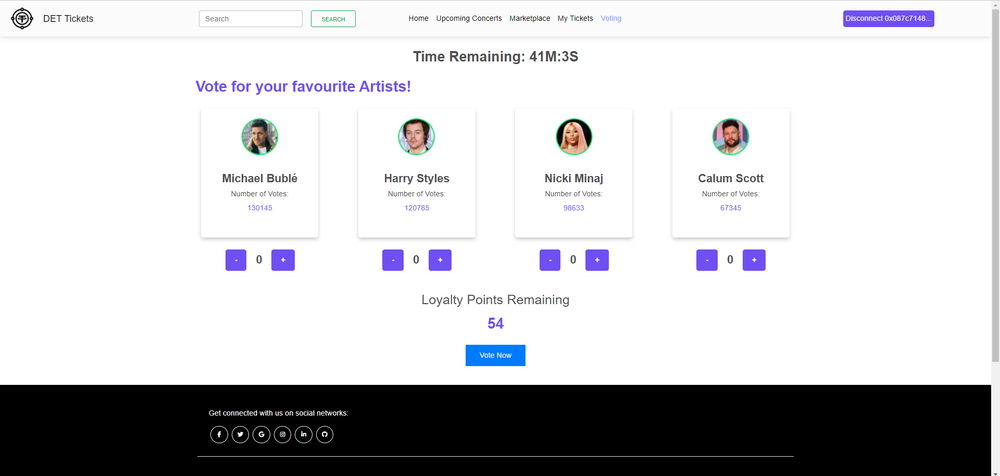
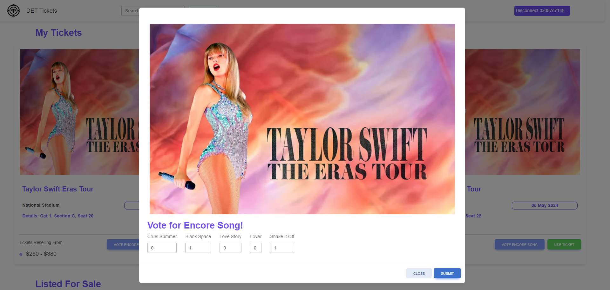

# IS4302 Decentralized Event Ticketing System (DETS)

## Description

This project aims to develop a decentralized application (DApp) for event ticketing, utilizing blockchain technology. Tickets are issued as smart contracts, ensuring transparency and traceability of each ticket's origin and transfer history. Leveraging blockchain, this system combats ticketing fraud and reduces scalping, ultimately creating a fairer and more transparent event ticketing industry.

## Purpose

The purpose of this project is to address issues of fraud and scalping in the event ticketing industry. By implementing a decentralized system, we aim to provide fairer access to event tickets for genuine fans while promoting transparency and trust in the ticketing process.

## Features

- **Ticket Issuance and Management**
  <br>
  
  <br>
  - Tickets are represented as smart contracts, allowing for secure and transparent handling.
    <br>
- **Loyalty Points System**
  <br>
  
  <br>

  - A system to reward frequent attendees, which can be used for voting or accessing special ticket offers.

- **Fraud Prevention and Scalping Reduction**
  <br>
  
  <br>
  - Blockchain technology ensures that tickets cannot be duplicated and scalping activities can be controlled.
- **Voting System**
  <br>
  
  <br>
  
  <br>
  - Attendees can vote on concert details such as song choices or encores, directly influencing the event experience. They can also use their loyalty points to vote for upcoming events.
- **Lottery System**
  - A lottery feature where ticket buyers can participate in a draw, potentially winning free tickets. This aims to enhance engagement and provide additional incentives for ticket purchases on our platform.

## Technology Stack

- **Ethereum Blockchain**: For deploying smart contracts and managing transactions.
- **Solidity**: Programming language for writing smart contracts.
- **Truffle Suite**: For developing, testing, and deploying smart contracts.
- **MetaMask**: Ethereum wallet for interacting with the blockchain.
- **React.js**: Frontend framework for building the user interface.

## Project Setup

### Prerequisites

1. Install Node.js (which comes with npm) on your computer.
2. Install Truffle Suite:

   ```
   npm install -g truffle
   ```

3. Download and install MetaMask in your browser.

### Setting up the Project

1. **Clone the Repository:**

   ```
   git clone https://github.com/inukite/IS4302-Decentralized-Event-Ticketing-System.git
   cd IS4302-Decentralized-Event-Ticketing-System
   ```

2. **Install Dependencies:**

   ```
   npm install
   ```

3. **Compile Smart Contracts:**

   ```
   truffle compile
   ```

4. **Deploy Smart Contracts:**

   - Start Ganache and ensure it is running on `http://localhost:7545`.
   - Deploy the contracts to the local network:

     ```
     truffle migrate --reset
     ```

5. **Configure MetaMask:**

   - Install the MetaMask extension and follow the setup instructions to create a new wallet or import an existing one.

6. **Run the DApp:**
   ```
   npm start
   ```
   - Your DApp should now be running on [http://localhost:3000](http://localhost:3000).

### Usage

- Interact with the DApp through the web interface using MetaMask.
- Buy tickets on both presale and resale markets, vote on concert details, and earn loyalty points through interactions dictated by the smart contracts.
- Participate in the lottery: Engage with the lottery feature through the interface, where buying tickets automatically enrolls you in a chance to win further rewards.
